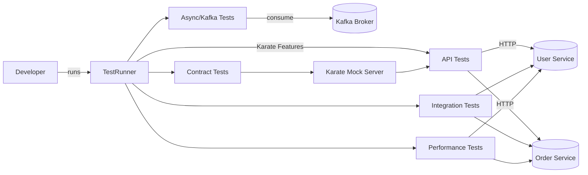
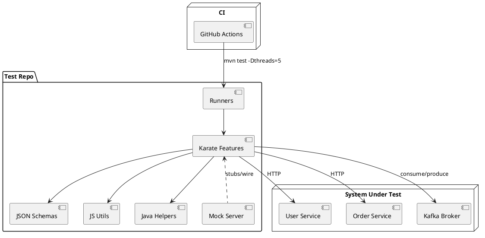

# Prompt Spec — Create a Microservices Test Automation Project with Karate

## 0) Mission

Create a **maintainable, parallel, CI-ready** API test automation project using **Karate** for a microservices platform. Include **API, integration, contract (consumer/provider), performance, and async/Kafka** tests, with **mocks**, **schemas**, and **shared utilities**. Produce **ready-to-run code**, **README**, and **CI pipeline**.

## 1) Tech Stack & Constraints

- **Language/Framework:** Karate (latest stable), Java 21 for helpers.
- **Build:** Maven (preferred) or Gradle; wire in Surefire & Failsafe as needed.
- **Reports:** Cucumber JSON + HTML (Karate default), publish in CI artifacts.
- **Style:** DRY features, shared JS utils, JSON schemas for validation.
- **Parallelism:** Make parallel degree configurable (system property).
- **Environments:** `dev`, `qa`, `prod` via `karate-config.js`; base URLs from env vars.
- **Secrets:** Read from env vars or `.env` (never commit secrets).

## 2) Deliverables

1. **Working repo** with source, tests, runners, mocks, contracts, data, and helper Java classes.
2. **Project structure** (exactly as below) with **sample features** that pass when the mock server runs.
3. **README** with setup, local run commands, CI usage, env matrix, and troubleshooting.
4. **CI pipeline** (GitHub Actions YAML) with cache, matrix on JDKs, report upload.
5. **Example Postman import** (optional), **OpenAPI links** (if provided).
6. **Makefile** (or `npm scripts`) for common tasks: `test`, `test:contract`, `test:perf`, `mock:start`.

> Use this recommended layout as your baseline and fill it with working code and samples.

```
karate-microservices-testing/
├── src/
│   ├── test/
│   │   ├── java/
│   │   │   ├── TestRunner.java
│   │   │   ├── PerformanceTestRunner.java
│   │   │   └── helpers/
│   │   │       ├── KafkaHelper.java
│   │   │       ├── ContractVerifier.java
│   │   │       └── CustomValidators.java
│   │   └── resources/
│   │       ├── karate-config.js
│   │       ├── logback-test.xml
│   │       ├── common/
│   │       │   ├── auth/
│   │       │   │   ├── oauth2.feature
│   │       │   │   └── jwt-token.feature
│   │       │   ├── headers/common-headers.js
│   │       │   ├── schemas/
│   │       │   │   ├── user-schema.json
│   │       │   │   ├── error-schema.json
│   │       │   │   └── pagination-schema.json
│   │       │   └── utils/
│   │       │       ├── data-generator.js
│   │       │       ├── validators.js
│   │       │       └── retry-logic.feature
│   │       ├── services/
│   │       │   ├── user-service/
│   │       │   │   ├── api/
│   │       │   │   │   ├── users.feature
│   │       │   │   │   ├── user-profile.feature
│   │       │   │   │   └── users-negative.feature
│   │       │   │   ├── contracts/
│   │       │   │   │   ├── consumer/user-service-consumer.feature
│   │       │   │   │   └── provider/user-service-provider.feature
│   │       │   │   ├── performance/user-load-test.feature
│   │       │   │   ├── async/user-events.feature
│   │       │   │   ├── mocks/user-service-mock.feature
│   │       │   │   └── config/user-service-config.js
│   │       │   └── order-service/ (mirror structure)
│   │       ├── integration/
│   │       │   ├── user-order-flow.feature
│   │       │   └── end-to-end-checkout.feature
│   │       ├── mocks/
│   │       │   ├── mock-server.feature
│   │       │   └── mock-responses/
│   │       │       ├── user-responses.json
│   │       │       └── order-responses.json
│   │       └── data/
│   │           ├── test-data.json
│   │           ├── test-users.csv
│   │           └── contracts/pact-definitions/
│   └── main/java/ (only if Java helpers needed)
├── pom.xml
├── Makefile
├── .env.example
└── README.md
```

## 3) Core Implementation Requirements (show code)

### 3.1 `karate-config.js`

```javascript
function fn() {
  var env = karate.env || "dev";
  var base =
    karate.properties["baseUrl"] ||
    java.lang.System.getenv("BASE_URL") ||
    "http://localhost:8080";

  var config = {
    env: env,
    baseUrl: base,
    timeout: 30000,
    retryConfig: { count: 3, interval: 2000 },
    mockMode: env === "dev",
    auth: {},
    utils: karate.call("classpath:common/utils/data-generator.js"),
  };

  if (env === "qa") config.baseUrl = base;
  if (env === "prod") config.baseUrl = base;

  karate.configure("connectTimeout", 10000);
  karate.configure("readTimeout", 30000);
  return config;
}
```

### 3.2 Reusable OAuth2 helper

```gherkin
# common/auth/oauth2.feature
Feature: OAuth2 Client Credentials

Background:
  * url karate.get('authBaseUrl', karate.get('baseUrl') + '/auth')

@name=getAccessToken
Scenario: Obtain access token
  Given path '/oauth/token'
  And form field grant_type = 'client_credentials'
  And form field client_id = karate.get('clientId')
  And form field client_secret = karate.get('clientSecret')
  When method post
  Then status 200
  * def accessToken = response.access_token
```

### 3.3 API tests (example)

```gherkin
# services/user-service/api/users.feature
Feature: User Service API

Background:
  * def token = call read('classpath:common/auth/oauth2.feature@getAccessToken')
  * url baseUrl + '/users'
  * header Authorization = 'Bearer ' + token.accessToken
  * def expected = read('classpath:common/schemas/user-schema.json')

Scenario: Create user
  Given request { name: 'John Doe', email: 'john@example.com' }
  When method post
  Then status 201
  And match response == expected
  And match response.name == 'John Doe'

Scenario Outline: Get user by id
  Given path '<id>'
  When method get
  Then status <code>

  Examples:
    | id | code |
    | 1  | 200  |
    | 99999 | 404 |
```

### 3.4 Async/Kafka test + Java helper

```gherkin
# services/user-service/async/user-events.feature
Feature: User creation emits Kafka event

Background:
  * def KafkaHelper = Java.type('helpers.KafkaHelper')
  * def kafka = new KafkaHelper()

Scenario: Create user -> consume event
  Given url baseUrl + '/users'
  And request { name: 'Jane Doe', email: 'jane@example.com' }
  When method post
  Then status 201
  * def userId = response.id
  * def event = kafka.consumeMessage('user-events-topic', 10000)
  * match event.userId == userId
  * match event.eventType == 'USER_CREATED'
```

```java
// src/test/java/helpers/KafkaHelper.java
import java.util.Map;
public class KafkaHelper {
  public Map<String, Object> consumeMessage(String topic, long timeoutMs) {
    // TODO: implement consumer logic (props via env vars)
    return Map.of("userId", 1, "eventType", "USER_CREATED");
  }
  public void publishMessage(String topic, Map<String, Object> message) {
    // TODO: implement producer logic
  }
}
```

### 3.5 Contract (consumer) example

```gherkin
# services/user-service/contracts/consumer/user-service-consumer.feature
Feature: Consumer contract for user payload

Background:
  * url karate.get('mockServerUrl', 'http://localhost:8090')
  * configure retry = { count: 3, interval: 1000 }

Scenario: Expected shape for /users/1
  Given path '/users/1'
  When method get
  Then status 200
  And match response ==
  """
  { id: '#number', name: '#string', email: '#string',
    createdAt: '#string', metadata: { version: '#string', source: '#string' } }
  """
  * karate.write(response, 'target/contracts/user-consumer-contract.json')
```

### 3.6 Performance example

```gherkin
# services/user-service/performance/user-load-test.feature
Feature: Load test — create 100 users
Scenario: burst
  * def createUser = function(){ return call read('../api/users.feature@Create user') }
  * def result = karate.repeat(100, createUser)
  * match each result contains { status: 201 }
```

```java
// src/test/java/PerformanceTestRunner.java
import com.intuit.karate.Runner;
import org.junit.jupiter.api.Test;
public class PerformanceTestRunner {
  @Test
  void performance() {
    Runner.path("classpath:services/user-service/performance")
      .outputCucumberJson(true)
      .parallel(Integer.parseInt(System.getProperty("threads", "10")));
  }
}
```

### 3.7 Test Runner + Hooks

```java
// src/test/java/TestRunner.java
import com.intuit.karate.junit5.Karate;
import com.intuit.karate.Runner;

class TestRunner {
  @Karate.Test
  Karate runAll() {
    return Karate.run("classpath:services")
      .tags("~@ignore")
      .karateEnv(System.getProperty("karate.env", "dev"));
  }
  public static void main(String[] args) {
    Runner.path("classpath:services").parallel(Integer.parseInt(System.getProperty("threads","5")));
  }
}
```

### 3.8 Mock server

```gherkin
# src/test/resources/mocks/mock-server.feature
Feature: Local mock for external deps

Scenario: pathMatches('/api/external/users/{id}') && methodIs('get')
  * def body = read('classpath:mocks/mock-responses/user-responses.json')
  * def response = body
  * def responseStatus = 200

Scenario: pathMatches('/api/external/payments') && methodIs('post')
  * def response = { transactionId: '#(uuid())', status: 'SUCCESS' }
  * def responseStatus = 200
```

### 3.9 Shared JS utils

```javascript
// common/utils/data-generator.js
function() {
  return {
    randomEmail: function() { return 'user_' + java.util.UUID.randomUUID() + '@test.com'; },
    randomUser: function() { return { name: 'Test ' + Math.random(), email: this.randomEmail() }; },
    waitFor: function(fn, timeoutMs, intervalMs) {
      var start = Date.now();
      while (Date.now() - start < timeoutMs) {
        if (fn()) return true;
        java.lang.Thread.sleep(intervalMs || 500);
      }
      return false;
    }
  };
}
```

## 4) Conventions & Quality Gates

- **Tag taxonomy:** `@smoke`, `@regression`, `@contract`, `@perf`, `@async`, `@e2e`, `@ignore`.
- **Schema-first:** All response validations use JSON schemas where stable; inline matchers for dynamic fields.
- **Headers:** centralize defaults in `common/headers/common-headers.js`.
- **Retries:** Only for idempotent GET/HEAD; never for POST unless explicitly safe.
- **Idempotent data setup:** Prefer API factories + cleanup, or namespace test records by run ID.
- **Flakiness budget:** Any test flaking twice in CI is quarantined (`@ignore`) and ticketed.

## 5) Environment & Data

- **Matrix:** Provide `.env.example` with `BASE_URL`, `AUTH_BASE_URL`, `CLIENT_ID`, `CLIENT_SECRET`, `KAFKA_BROKERS`, etc.
- **Data:** Keep under `src/test/resources/data`; use CSV for large sets.
- **Test users:** store in `test-users.csv` and load in features via `read()`.

## 6) CI Pipeline (GitHub Actions)

Create `.github/workflows/tests.yml`:

- Triggers: PR + main.
- Jobs:

  - Setup JDK 21, cache Maven.
  - Start mock server (Karate `mock-server.feature`) in background.
  - Run **smoke** (`--tags @smoke`) on PR, full suite nightly.
  - Upload `target/**/cucumber*.json` & HTML report artifacts.
  - Matrix: `{ os: ubuntu-latest, java: [21] }`.

- Flags:

  - `-Dkarate.env=qa -Dthreads=5`.
  - Fail build if any scenario fails.

## 7) Commands (Makefile)

```makefile
test:
	mvn -q -Dkarate.env=$(env) -Dthreads=$(threads) test
test-smoke:
	mvn -q -Dkarate.options="--tags @smoke" test
test-contract:
	mvn -q -Dkarate.options="--tags @contract" test
test-perf:
	mvn -q -Dtest=PerformanceTestRunner test
mock:
	mvn -q -Dtest=MockRunner test
```

## 8) Integration/E2E Sample

```gherkin
# integration/user-order-flow.feature
Feature: User places order end-to-end

Background:
  * def token = call read('classpath:common/auth/oauth2.feature@getAccessToken')
  * header Authorization = 'Bearer ' + token.accessToken

Scenario: Create user -> create order -> verify order status
  # Create user
  Given url baseUrl + '/users'
  And request { name: 'E2E User', email: 'e2e@example.com' }
  When method post
  Then status 201
  * def userId = response.id

  # Create order
  Given url baseUrl + '/orders'
  And request { userId: #(userId), sku: 'ABC-123', quantity: 1 }
  When method post
  Then status 201
  * def orderId = response.id

  # Verify order
  Given url baseUrl + '/orders/' + orderId
  When method get
  Then status 200
  And match response.status == 'CREATED'
```

## 9) Diagrams as Code

### 9.1 Mermaid — Test Architecture



### 9.2 PlantUML — Repo & Flow



## 10) README Requirements

- Quick start: JDK 21, Maven, `cp .env.example .env`, set env vars.
- How to run:

  - All tests: `mvn test -Dkarate.env=qa -Dthreads=5`
  - Service-only: `mvn test -Dkarate.options="--tags @user-service"`
  - Contracts: `mvn test -Dkarate.options="--tags @contract"`
  - Perf: `mvn -Dtest=PerformanceTestRunner test`

- Reports path and how to open HTML.
- Troubleshooting flakiness, timeouts, data collisions.
- Contributing: naming, tags, PR checks, schema changes.

## 11) Definition of Done (strict)

- Repo builds green locally and in CI.
- `mock-server.feature` enables tests to pass without real backends.
- Sample API/contract/async/perf/integration tests are implemented and **pass**.
- Reports are uploaded; failures cause CI to fail.
- README complete; `.env.example` present; Makefile works.
