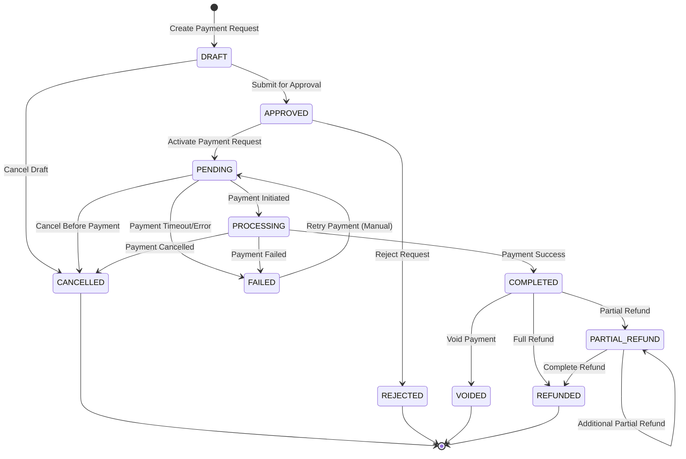

# Payment Request State Machine Documentation

## Document Information

- **Version**: 1.0
- **Last Updated**: January 1, 2025
- **Document Type**: Technical Documentation
- **Related**: payment-prd.md

---

## Table of Contents

1. [Overview](#overview)
2. [State Definitions](#state-definitions)
3. [State Transition Diagram](#state-transition-diagram)
4. [Transition Rules](#transition-rules)
5. [Business Logic](#business-logic)
6. [Implementation Details](#implementation-details)
7. [Validation Rules](#validation-rules)
8. [Error Handling](#error-handling)

---

## Overview

The Payment Request State Machine manages the lifecycle of payment requests from creation to completion. It ensures proper state transitions, maintains data integrity, and enforces business rules throughout the payment process.

### Key Characteristics

- **11 distinct states** covering the complete payment lifecycle
- **Unidirectional transitions** with specific business rules
- **Audit trail** for all state changes
- **Validation logic** preventing invalid transitions
- **Final state detection** for completed workflows

---

## State Definitions

### Initial States

#### DRAFT
- **Description**: Initial state, not yet active
- **Purpose**: Payment request is being created/edited
- **Characteristics**:
  - Can be modified freely
  - Not visible to payers
  - No payment token generated
  - Can be deleted

#### APPROVED
- **Description**: Payment request has been approved
- **Purpose**: Administrative approval before activation
- **Characteristics**:
  - Ready for activation
  - Cannot be modified without re-approval
  - Awaiting transition to PENDING

### Active States

#### PENDING
- **Description**: Active, awaiting payment
- **Purpose**: Payment request is live and accepting payments
- **Characteristics**:
  - Payment link is active
  - Can accept payment transactions
  - Has expiration date
  - Visible to payers

#### PROCESSING
- **Description**: Payment received, being processed
- **Purpose**: Payment transaction is being validated/processed
- **Characteristics**:
  - Payment attempt in progress
  - Temporary state during transaction processing
  - Cannot accept new payments
  - Automatic transition based on transaction result

### Success States

#### COMPLETED
- **Description**: Successfully completed
- **Purpose**: Payment successfully received and processed
- **Characteristics**:
  - Payment fully received
  - Can be voided or refunded
  - Final successful state
  - Triggers completion workflows

### Failure States

#### FAILED
- **Description**: Payment failed
- **Purpose**: Payment attempt failed permanently
- **Characteristics**:
  - All payment attempts exhausted
  - Cannot accept new payments
  - May be reset to PENDING for retry
  - Requires manual intervention

#### REJECTED
- **Description**: Payment request has been rejected
- **Purpose**: Administrative rejection of payment request
- **Characteristics**:
  - Cannot be activated
  - Requires approval to proceed
  - Final rejection state

### Cancellation States

#### CANCELLED
- **Description**: Cancelled by user/admin before payment
- **Purpose**: Payment request terminated before completion
- **Characteristics**:
  - No payment received
  - Cannot be reactivated
  - Final cancellation state
  - May have associated cancellation reason

### Post-Payment States

#### VOIDED
- **Description**: Voided after successful payment
- **Purpose**: Payment reversed/cancelled after completion
- **Characteristics**:
  - Original payment was successful
  - Payment has been reversed
  - Cannot be further modified
  - Final void state

#### REFUNDED
- **Description**: Full refund processed
- **Purpose**: Complete refund of successful payment
- **Characteristics**:
  - Full amount refunded
  - Cannot be further refunded
  - Final refund state
  - Maintains refund audit trail

#### PARTIAL_REFUND
- **Description**: Partial refund processed
- **Purpose**: Partial amount refunded, may allow additional refunds
- **Characteristics**:
  - Partial amount refunded
  - May allow additional partial refunds
  - Can transition to REFUNDED for full refund
  - Maintains refund history

---

## State Transition Diagram



---

## Transition Rules

### Valid Transitions

| From State | To State | Trigger | Conditions |
|------------|----------|---------|------------|
| DRAFT | APPROVED | Manual approval | Valid payment request data |
| DRAFT | CANCELLED | Manual cancellation | Any time |
| APPROVED | PENDING | Activation | Approval completed |
| APPROVED | REJECTED | Manual rejection | Administrative decision |
| PENDING | PROCESSING | Payment initiation | Valid payment attempt |
| PENDING | CANCELLED | Manual cancellation | Before payment received |
| PENDING | FAILED | Payment failure | All retry attempts exhausted |
| PROCESSING | COMPLETED | Payment success | Transaction successful |
| PROCESSING | FAILED | Payment failure | Transaction failed |
| PROCESSING | CANCELLED | Payment cancellation | Transaction cancelled |
| COMPLETED | VOIDED | Void operation | Within void window |
| COMPLETED | REFUNDED | Full refund | Refund request |
| COMPLETED | PARTIAL_REFUND | Partial refund | Partial refund request |
| PARTIAL_REFUND | REFUNDED | Complete refund | Remaining amount refunded |
| PARTIAL_REFUND | PARTIAL_REFUND | Additional refund | Additional partial refund |
| FAILED | PENDING | Manual retry | Administrative reset |

### Invalid Transitions

- **No backward transitions** except FAILED → PENDING (manual retry)
- **No transitions from final states** (CANCELLED, REJECTED, VOIDED, REFUNDED)
- **No direct transitions** from DRAFT to PENDING (must go through APPROVED)
- **No transitions from PROCESSING** except to final states

---

## Business Logic

### State Validation Methods

```java
// From PaymentRequestStatus.java
public boolean canAcceptPayment() {
    return this == PENDING;
}

public boolean canBeCancelled() {
    return this == DRAFT || this == PENDING;
}

public boolean canBeVoided() {
    return this == COMPLETED;
}

public boolean canBeRefunded() {
    return this == COMPLETED || this == PARTIAL_REFUND;
}

public boolean isFinalState() {
    return this == COMPLETED || this == FAILED || this == CANCELLED || 
           this == VOIDED || this == REFUNDED || this == REJECTED;
}
```

### Entity Business Methods

```java
// From PaymentRequest.java
public boolean isExpired() {
    return expiresAt != null && LocalDateTime.now().isAfter(expiresAt);
}

public boolean canAcceptPayment() {
    return status.canAcceptPayment() && !isExpired();
}
```

### Automatic Transitions

1. **PENDING → PROCESSING**: Triggered by payment initiation
2. **PROCESSING → COMPLETED**: Triggered by successful transaction
3. **PROCESSING → FAILED**: Triggered by failed transaction
4. **PROCESSING → CANCELLED**: Triggered by cancelled transaction

### Manual Transitions

1. **DRAFT → APPROVED**: Administrative approval
2. **APPROVED → PENDING**: Manual activation
3. **APPROVED → REJECTED**: Administrative rejection
4. **PENDING → CANCELLED**: Manual cancellation
5. **COMPLETED → VOIDED**: Manual void operation
6. **COMPLETED → REFUNDED**: Manual full refund
7. **COMPLETED → PARTIAL_REFUND**: Manual partial refund
8. **FAILED → PENDING**: Manual retry (reset)

---

## Implementation Details

### Database Schema

```sql
-- Payment request status enum
CREATE TYPE payment_request_status AS ENUM (
    'DRAFT',
    'PENDING',
    'PROCESSING',
    'COMPLETED',
    'FAILED',
    'CANCELLED',
    'VOIDED',
    'REFUNDED',
    'PARTIAL_REFUND',
    'APPROVED',
    'REJECTED'
);
```

### API Endpoints

| Endpoint | Method | Purpose | State Transition |
|----------|--------|---------|------------------|
| `/api/v1/payments/requests/{id}/approve` | PATCH | Approve request | DRAFT → APPROVED |
| `/api/v1/payments/requests/{id}/reject` | PATCH | Reject request | APPROVED → REJECTED |
| `/api/v1/payments/requests/{id}/cancel` | PATCH | Cancel request | DRAFT/PENDING → CANCELLED |
| `/api/v1/payments/requests/{id}/activate` | PATCH | Activate request | APPROVED → PENDING |
| `/api/v1/payments/requests/{id}/void` | PATCH | Void payment | COMPLETED → VOIDED |
| `/api/v1/payments/requests/{id}/refund` | POST | Process refund | COMPLETED → REFUNDED/PARTIAL_REFUND |

### Audit Trail

All state transitions are logged in the `payment_audit_log` table:

```sql
INSERT INTO payment_audit_log (
    payment_request_id, action, entity_type, 
    old_status, new_status, changes, reason,
    ip_address, user_agent, created_at, created_by
) VALUES (...);
```

---

## Validation Rules

### Pre-Transition Validation

1. **State Compatibility**: Verify current state allows the requested transition
2. **Business Rules**: Check business-specific conditions (expiration, permissions)
3. **Data Integrity**: Ensure required fields are present and valid
4. **Concurrency**: Handle concurrent state change attempts

### Post-Transition Actions

1. **Audit Logging**: Record state change in audit log
2. **Notifications**: Send relevant notifications (email, webhooks)
3. **Workflow Triggers**: Initiate downstream processes
4. **Cache Updates**: Update cached state information

### Expiration Handling

- **PENDING** requests can expire based on `expires_at` timestamp
- Expired requests cannot accept payments
- Automatic cleanup processes may transition expired requests to FAILED

---

## Error Handling

### Invalid Transition Attempts

```java
public class InvalidStateTransitionException extends RuntimeException {
    private final PaymentRequestStatus fromState;
    private final PaymentRequestStatus toState;
    
    public InvalidStateTransitionException(PaymentRequestStatus from, PaymentRequestStatus to) {
        super(String.format("Invalid transition from %s to %s", from, to));
        this.fromState = from;
        this.toState = to;
    }
}
```

### Concurrent Modification

- Use optimistic locking with version fields
- Retry logic for transient failures
- Clear error messages for permanent failures

### Recovery Scenarios

1. **Failed Payments**: Manual retry through FAILED → PENDING transition
2. **Stuck Processing**: Administrative intervention to resolve
3. **Data Corruption**: Audit trail analysis and manual correction
4. **System Failures**: Automatic recovery through transaction rollback

---

## Integration Points

### Payment Gateway Integration

- State transitions triggered by gateway webhooks
- Asynchronous processing for PROCESSING state
- Retry mechanisms for failed gateway communications

### Notification System

- Email notifications for state changes
- Webhook callbacks for external systems
- Real-time updates for frontend applications

### Reporting System

- State distribution analytics
- Transition timing analysis
- Failure pattern identification
- Revenue tracking by state

---

## Monitoring and Metrics

### Key Metrics

1. **State Distribution**: Count of requests in each state
2. **Transition Times**: Average time spent in each state
3. **Success Rate**: Percentage of requests reaching COMPLETED
4. **Failure Analysis**: Common failure patterns and causes
5. **Refund Rate**: Percentage of completed payments refunded

### Alerts

- Requests stuck in PROCESSING for too long
- High failure rates for specific payment methods
- Unusual state transition patterns
- System errors during state changes

---

## Future Enhancements

### Planned Features

1. **Conditional Transitions**: State transitions based on complex business rules
2. **Parallel Processing**: Multiple payment attempts in parallel
3. **Scheduled Transitions**: Time-based automatic state changes
4. **Custom Workflows**: Tenant-specific state machine configurations
5. **State Machine Versioning**: Support for multiple state machine versions

### Technical Improvements

1. **Event Sourcing**: Complete event history for state changes
2. **CQRS Implementation**: Separate read/write models for state
3. **Distributed State Management**: Multi-service state coordination
4. **Performance Optimization**: Caching and indexing improvements